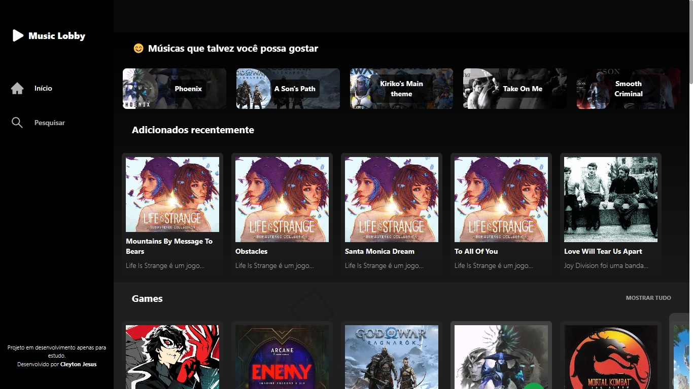
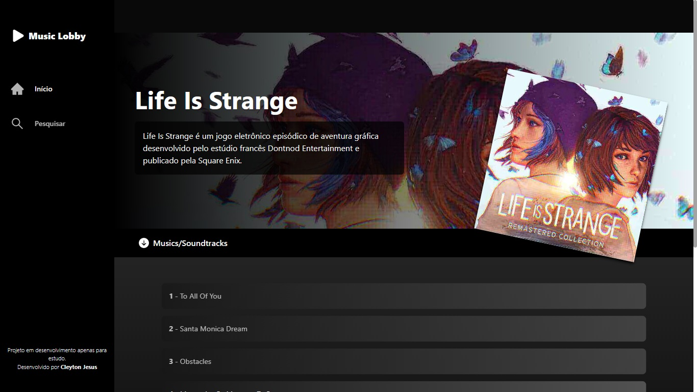
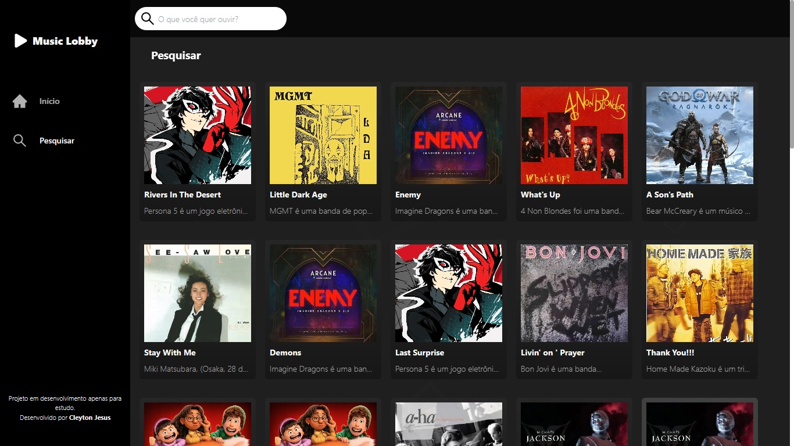

<h1>🎶▶️ MUSIC LOBBY(Português-BR) 🎶(~˘▾˘)~</h1>

ᕕ( ᐛ )ᕗ - Music Lobby é um projeto pessoal(em andamento) que consiste em você ouvir algumas músicas enquanto esteja fazendo qualquer outra coisa.

<h3>｡◕‿◕｡ - Tecnologias:</h3>
Foram utilizadas as seguintes tecnologias:
<ul style="list-style:none">
<li>HTML</li>
<li>JS</li>
<li>CSS</li>
<li>React JS</li>
<li>Next JS</li>
<li>Tailwind CSS</li>
<li>Supabase</li>
</ul>
<hr/>
    <h3> ☜(⌒▽⌒)☞ - Imagens do projeto:</h3>
    <h4>Tela Inicial</h4>
    
    <h4>Tela das músicas</h4>
    
    <h4>Tela de pesquisa</h4>
    
<hr/>
O projeto está hospedado na Vercel:
    <a href="https://music-lobby.vercel.app/">Music Lobby</a>
<hr/>
<br/>
<br/>
<br/>
<h1>🎶▶️ MUSIC LOBBY(English-US) 🎶(~˘▾˘)~</h1>

ᕕ( ᐛ )ᕗ - Music Lobby is a personal project (work in progress) that consists of you listening to some music while doing something else.

<h3>｡◕‿◕｡ - Technologies:</h3>
The following technologies were used:
<ul style="list-style:none">
<li>HTML</li>
<li>JS</li>
<li>CSS</li>
<li>React JS</li>
<li>Next JS</li>
<li>Tailwind CSS</li>
<li>Supabase</li>
</ul>
<hr/>
    <h3> ☜(⌒▽⌒)☞ - Project images:</h3>
    <h4>Main screen</h4>
    
    <h4>Songs screen</h4>
    
    <h4>Search screen</h4>
    
<hr/>
The project is hosted at Vercel:
    <a href="https://music-lobby.vercel.app/">Music Lobby</a>
<hr/>
<br/>
<br/>
<br/>
This is a [Next.js](https://nextjs.org/) project bootstrapped with [`create-next-app`](https://github.com/vercel/next.js/tree/canary/packages/create-next-app).

## Getting Started

First, run the development server:

```bash
npm run dev
# or
yarn dev
```

Open [http://localhost:3000](http://localhost:3000) with your browser to see the result.

You can start editing the page by modifying `pages/index.js`. The page auto-updates as you edit the file.

[API routes](https://nextjs.org/docs/api-routes/introduction) can be accessed on [http://localhost:3000/api/hello](http://localhost:3000/api/hello). This endpoint can be edited in `pages/api/hello.js`.

The `pages/api` directory is mapped to `/api/*`. Files in this directory are treated as [API routes](https://nextjs.org/docs/api-routes/introduction) instead of React pages.

## Learn More

To learn more about Next.js, take a look at the following resources:

- [Next.js Documentation](https://nextjs.org/docs) - learn about Next.js features and API.
- [Learn Next.js](https://nextjs.org/learn) - an interactive Next.js tutorial.

You can check out [the Next.js GitHub repository](https://github.com/vercel/next.js/) - your feedback and contributions are welcome!

## Deploy on Vercel

The easiest way to deploy your Next.js app is to use the [Vercel Platform](https://vercel.com/new?utm_medium=default-template&filter=next.js&utm_source=create-next-app&utm_campaign=create-next-app-readme) from the creators of Next.js.

Check out our [Next.js deployment documentation](https://nextjs.org/docs/deployment) for more details.
